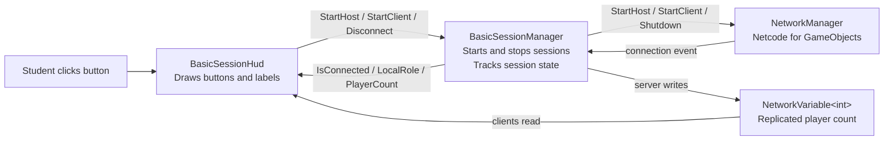
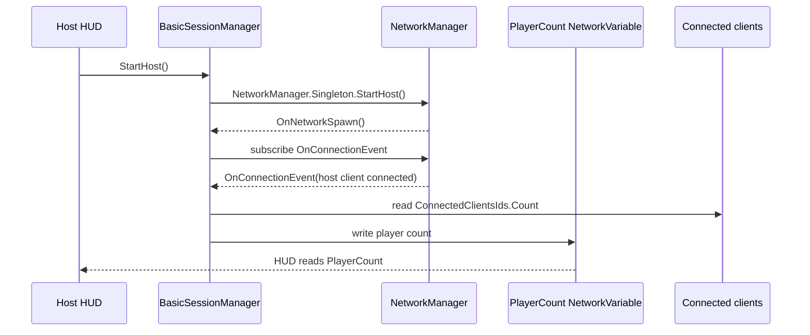
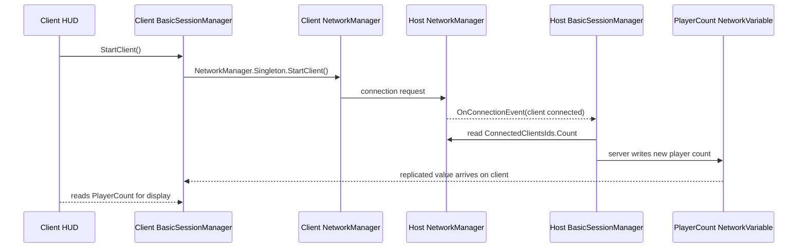
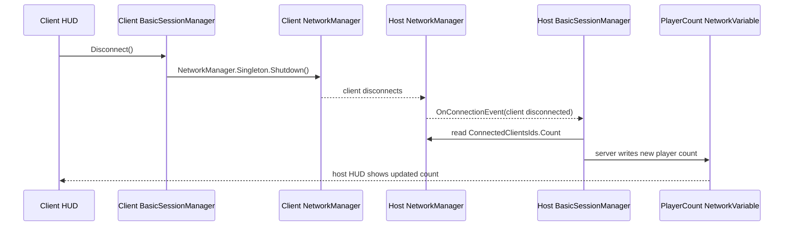
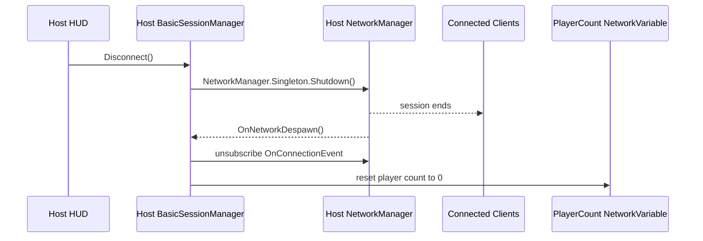
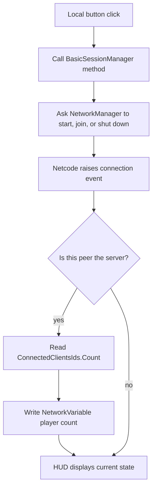

# Basic Session Manager Diagrams

These diagrams show the first session-management lesson: starting a host, joining as a client, disconnecting, and updating the replicated player count.

## 1. What Each Script Is Responsible For



Key idea: the HUD is not the session. It only shows controls and reads state from `BasicSessionManager`.

## 2. Starting A Host



Key idea: a host is both the server and a local client, so the host counts as one connected player.

## 3. Joining As A Client



Key idea: the client asks to join, but the server is the peer that updates shared session state.

## 4. Disconnecting A Client



Key idea: a disconnect is also a connection event. The manager does not need separate increment and decrement code; it asks Netcode how many clients are connected now.

## 5. Host Shutdown



Key idea: when the host shuts down, the server goes away. The session is over for everyone.

## 6. The Repeated Pattern



Teaching shortcut:

```text
Button -> Manager action -> NetworkManager -> connection event -> server updates count -> HUD displays state
```

